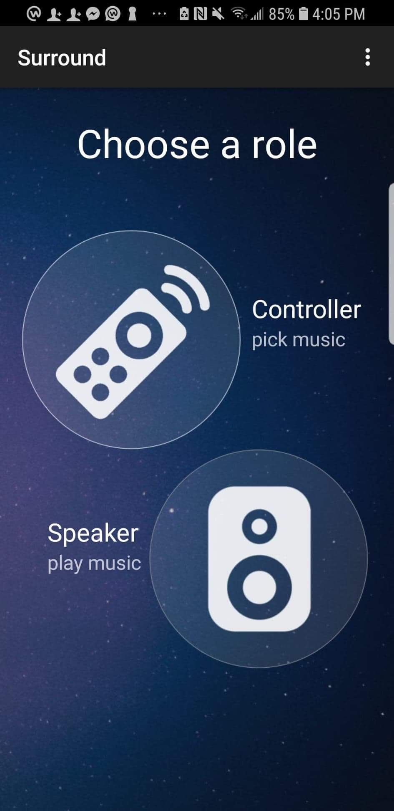
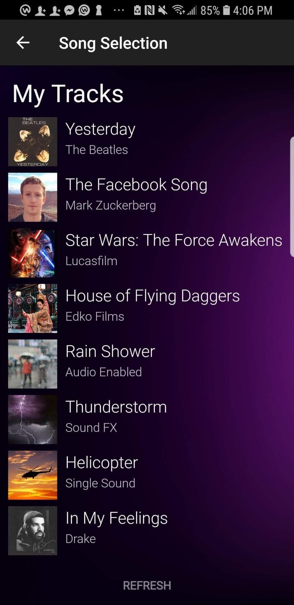
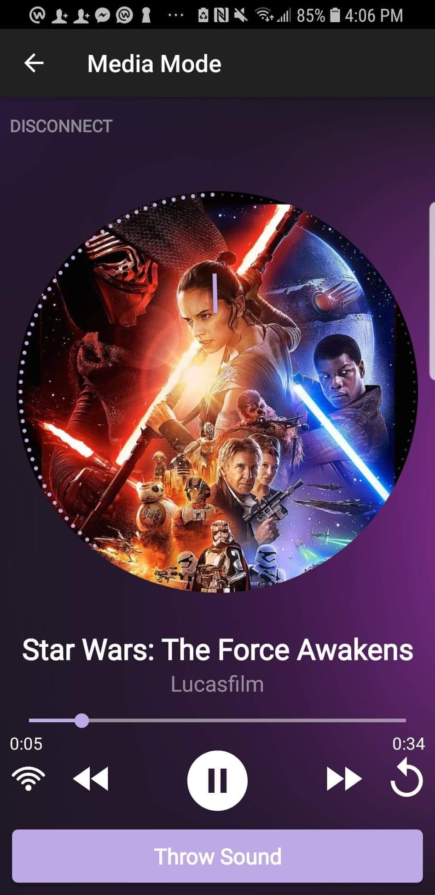
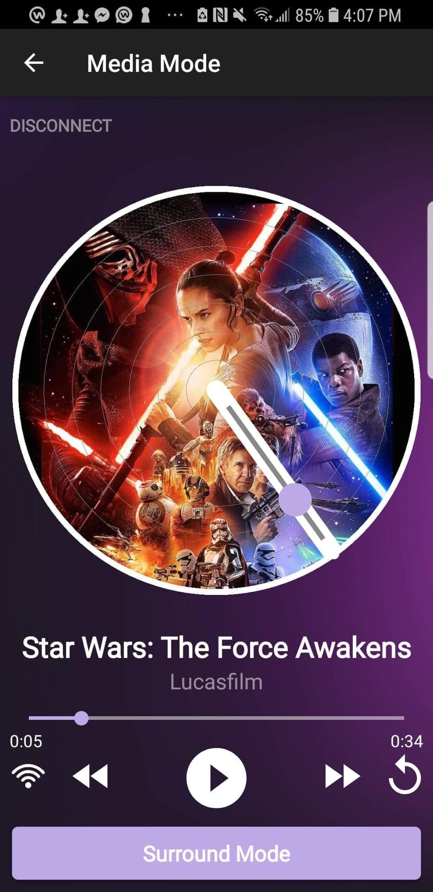
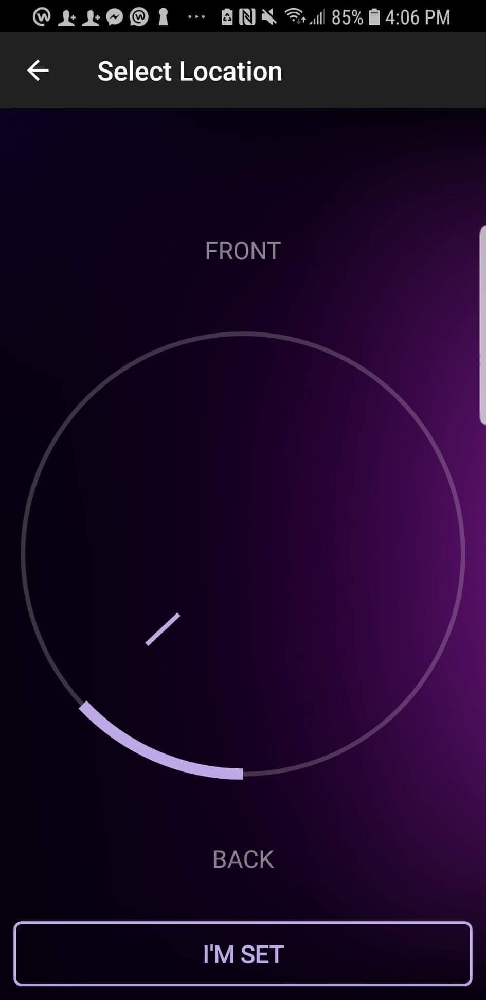

# FBU Surround App

**Platform:** Android mobile application

## Developers
Hannah Park (UCLA, June 2021), Heriberto Gonzalez (Pomona, May 2020), Greta Browne (Yale, May 2021)

## Premise
Many groups find themselves speakerless in situations that call for amplification. Surround connects phones and turns them into a surround sound system so people get a great audio experience even without speakers. 

## Features
•	Two roles: The “controller” phone selects the audio track and manipulates how it will be played on the “speaker” phones

•	Audio playback of any audio file in up to 5.1 surround sound (pause, play, seek, restart, volume)

•	Users on controller phones can move the sound from speaker phone to speaker phone in order to “throw” the sound around a space

•	Speaker phones use a live query-enabled Parse server to listen for updates from the controller phones (global clock, play/pause, volume, location, etc.)

•	Option to have multiple controllers play different audio tracks on the speaker phones

## Recognition
Selected out of 20 Android teams built by Facebook interns, and was presented to *Mark Zuckerberg* at the end of team's software engineering internship

## Screenshots

Home Screen:

Controller Screens:

Speaker Screens:

## License

    Copyright [2018] [Hannah Park]

    Licensed under the Apache License, Version 2.0 (the "License");
    you may not use this file except in compliance with the License.
    You may obtain a copy of the License at

        http://www.apache.org/licenses/LICENSE-2.0

    Unless required by applicable law or agreed to in writing, software
    distributed under the License is distributed on an "AS IS" BASIS,
    WITHOUT WARRANTIES OR CONDITIONS OF ANY KIND, either express or implied.
    See the License for the specific language governing permissions and
    limitations under the License.
